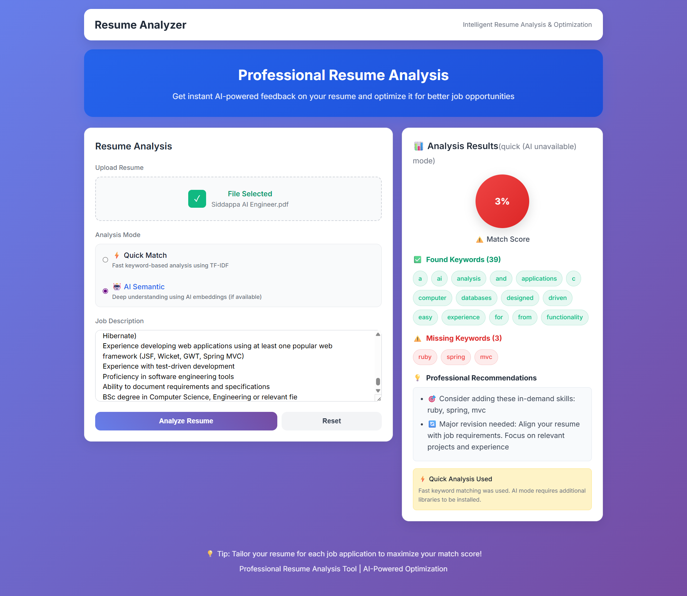
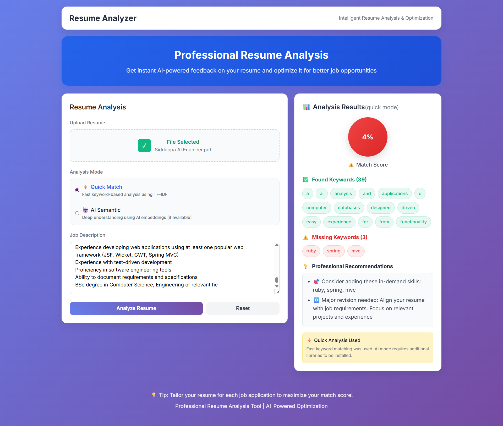
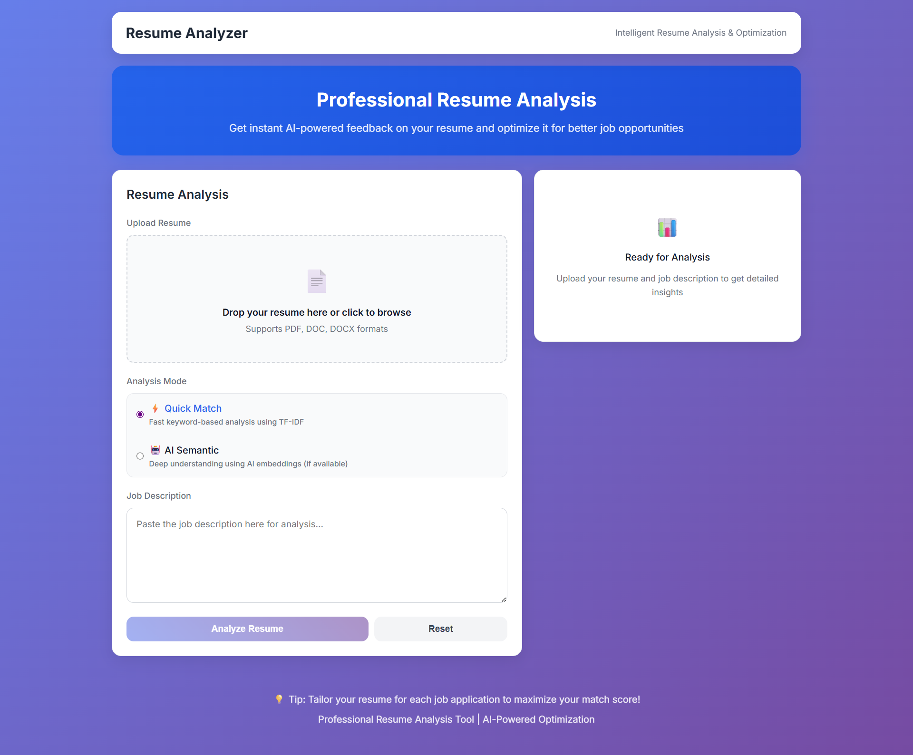

# AI Resume Analyzer

A professional, AI-powered resume analysis tool that helps job seekers optimize their resumes for better job opportunities. Built with React frontend and Flask backend.

## Features

- **Smart Resume Upload** - Supports PDF, DOC, and DOCX formats
- **Dual Analysis Modes**:
  - **Quick Mode**: Fast TF-IDF keyword matching
  - **AI Mode**: Advanced semantic analysis using embeddings
- **Intelligent Scoring** - Get instant compatibility scores
- **Professional Recommendations** - Actionable suggestions to improve your resume
- **Modern UI** - Clean, professional interface with real-time feedback

## Screenshots

### AI Mode Analysis

*Advanced semantic analysis provides deep understanding of resume-job compatibility*

### Quick Mode Analysis

*Fast keyword-based analysis for immediate feedback*

### Application Interface

*Clean, professional interface for resume upload and analysis*

## Tech Stack

**Frontend:**
- React 18 + Vite
- Modern CSS3 with gradients
- Responsive design

**Backend:**
- Flask (Python)
- scikit-learn (TF-IDF analysis)
- PyPDF2 (PDF processing)
- python-docx (Word documents)

## Quick Start

### Installation

1. **Backend Setup**
   ```bash
   cd backend
   python -m venv venv
   venv\Scripts\activate  # Windows
   # source venv/bin/activate  # macOS/Linux
   pip install -r requirements.txt
   ```

2. **Frontend Setup**
   ```bash
   cd frontend
   npm install
   ```

### Running the Application

1. **Start Backend** (Terminal 1)
   ```bash
   cd backend
   venv\Scripts\activate
   python app.py
   ```
   Backend runs on: `http://127.0.0.1:5000`

2. **Start Frontend** (Terminal 2)
   ```bash
   cd frontend
   npm run dev
   ```
   Frontend runs on: `http://localhost:5173`

## How It Works

### Analysis Modes

#### Quick Mode
- **TF-IDF Algorithm** - Fast keyword matching
- Instant results with matched/missing keywords
- Perfect for quick compatibility checks

#### AI Mode *(Advanced)*
- **Semantic Analysis** - Deep text understanding
- Identifies synonyms and related concepts
- Requires additional ML libraries

### Usage Steps

1. **Upload Resume** - PDF, DOC, or DOCX
2. **Add Job Description** - Paste any job posting
3. **Choose Mode** - Quick or AI analysis
4. **Analyze** - Get instant results
5. **Review** - Compatibility score + recommendations

## What You Get

- **Compatibility Score** (0-100%)
- **Matched Keywords** - Found in both documents
- **Missing Keywords** - Skills to add
- **Professional Recommendations** - Improvement tips
- **Analysis Details** - Mode used and insights

## Optional: AI Mode Setup

For advanced semantic analysis, install additional packages:

```bash
pip install transformers torch sentence-transformers
```

*Note: AI mode works without these packages but falls back to enhanced TF-IDF.*

## Contributing

1. Fork the repository
2. Create feature branch: `git checkout -b feature-name`
3. Commit changes: `git commit -m 'Add feature'`
4. Push to branch: `git push origin feature-name`
5. Submit Pull Request